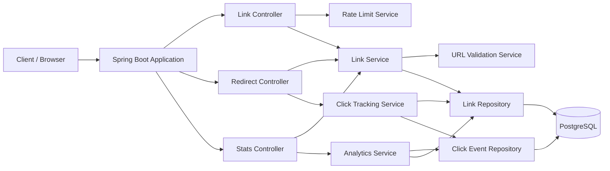
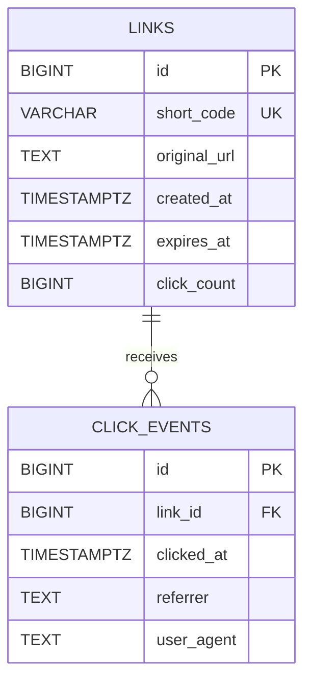
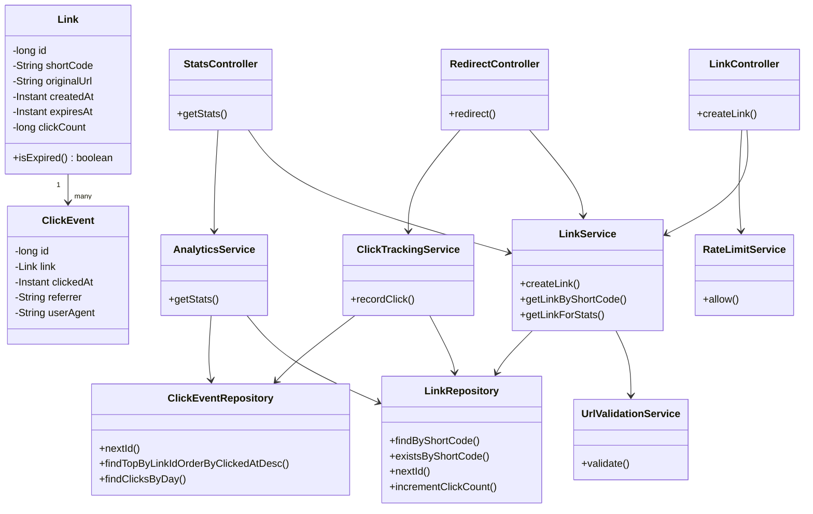

# URL Shortener & Click Analytics

A Spring Boot backend service for shortening URLs and tracking link usage. The project is designed as a small but production-minded backend system that demonstrates REST API design, PostgreSQL persistence, unique ID generation, Base62 encoding, concurrency-safe counters, analytics, validation, rate limiting, and a clear path toward horizontal scalability.

## Table of Contents

- [Overview](#overview)
- [Goals](#goals)
- [Technology Stack](#technology-stack)
- [Current Architecture](#current-architecture)
- [System Design](#system-design)
- [Core Request Flows](#core-request-flows)
- [Database Design](#database-design)
- [Low-Level Design](#low-level-design)
- [Concurrency and Data Consistency](#concurrency-and-data-consistency)
- [API Design](#api-design)
- [Validation and Abuse Protection](#validation-and-abuse-protection)
- [Testing Strategy](#testing-strategy)
- [Current Scope](#current-scope)
- [Future Scalability](#future-scalability)
- [Scalability Roadmap](#scalability-roadmap)
- [Engineering Trade-offs](#engineering-trade-offs)
- [Running Locally](#running-locally)

## Overview

The service converts a long URL into a short URL such as:

```text
https://example.com/articles/backend-system-design
                         ↓
http://localhost:8080/2b
```

When a user opens the short URL, the service looks up the destination and returns an HTTP `302 Found` redirect.

The system is intentionally implemented as a **single Spring Boot application backed by PostgreSQL**. The first version avoids unnecessary distributed infrastructure and focuses on correctness, clean separation of responsibilities, and measurable performance.

The planned analytics layer records click events including:

- click timestamp
- HTTP referrer
- user-agent

This event data can later be extended to support richer analytics such as clicks by day, campaign tracking, device categories, and geographic aggregation.

---

## Goals

The project has four main goals:

1. Build a complete URL-shortening workflow from API request to redirect.
2. Apply backend engineering principles such as layered architecture, database constraints, validation, and concurrency-safe updates.
3. Keep the initial implementation simple enough to deploy and use by real users.
4. Provide a realistic architecture that can evolve from a single-instance application into a horizontally scalable service.

---

## Technology Stack

| Layer | Technology |
|---|---|
| Language | Java |
| Framework | Spring Boot |
| Web | Spring Web / Spring MVC |
| Persistence | Spring Data JPA / Hibernate |
| Database | PostgreSQL |
| Identifier encoding | Base62 |
| Validation | Jakarta Bean Validation + application validation |
| Testing | JUnit 5, Mockito |
| Build | Maven |
| Containerization | Docker (planned) |
| CI/CD | GitHub Actions / Jenkins (planned) |
| Caching | Redis (future scalability step) |
| Load testing | k6 (planned) |

---

# Current Architecture

The initial system follows a layered architecture:

```text
                    Client
                      |
                      v
              +---------------+
              |   Controller  |
              +-------+-------+
                      |
                      v
              +---------------+
              |    Service    |
              +-------+-------+
                      |
                      v
              +---------------+
              |   Repository  |
              +-------+-------+
                      |
                      v
              +---------------+
              |  PostgreSQL   |
              +---------------+
```

The main responsibilities are separated as follows:

### Controller Layer

Handles HTTP concerns:

- request/response mapping
- path variables and request bodies
- HTTP status codes
- extracting request metadata such as `Referer` and `User-Agent`

### Service Layer

Contains business logic:

- URL creation
- Base62 short-code generation
- expiration checks
- URL validation
- click tracking
- analytics aggregation
- rate limiting

### Repository Layer

Provides persistence operations:

- link lookup by short code
- uniqueness checks
- sequence allocation
- click-event persistence
- analytics queries
- atomic click-count updates

### Database Layer

PostgreSQL stores the durable link data and click history.

---

# System Design

## High-Level Component Diagram



## Why a Modular Monolith?

The first version uses one deployable Spring Boot service rather than microservices.

This is intentional:

- link creation, redirects, and analytics are closely related;
- the expected initial traffic does not justify distributed infrastructure;
- one service is easier to test, deploy, observe, and debug;
- the system can later be decomposed only when there is a measurable reason to do so.

The design keeps business responsibilities separated internally, so introducing additional infrastructure later does not require rewriting the entire application.

---

# Core Request Flows

## 1. Create a Short URL

```text
POST /api/links
        |
        v
LinkController
        |
        v
RateLimitService
        |
        v
LinkService
        |
        +--> Validate URL
        |
        +--> Obtain next PostgreSQL sequence value
        |
        +--> Encode ID using Base62
        |
        +--> Persist Link
        |
        v
201 Created
```

For an automatically generated link:

```text
PostgreSQL sequence
        |
        v
      id = 123
        |
        v
Base62Encoder.encode(123)
        |
        v
    shortCode = "1Z"
```

The sequence is concurrency-safe because ID allocation is delegated to PostgreSQL rather than to a Java `synchronized` counter or an in-memory variable.

## 2. Redirect

```text
GET /{shortCode}
        |
        v
RedirectController
        |
        v
LinkService
        |
        +--> findByShortCode()
        |
        +--> check expiration
        |
        v
ClickTrackingService
        |
        +--> insert click event
        |
        +--> atomic click_count = click_count + 1
        |
        v
302 Found
Location: originalUrl
```

The redirect path is the expected hot path. For future high traffic, this path is the first place where caching can provide a significant reduction in database reads.

## 3. Retrieve Statistics

```text
GET /api/links/{code}/stats
        |
        v
StatsController
        |
        v
AnalyticsService
        |
        +--> total clicks from links.click_count
        +--> latest click from click_events
        +--> clicks grouped by day
        |
        v
200 OK
```

Expired links remain queryable for statistics even though they no longer redirect.

---

# Database Design

## Entity Relationship



## `links` Table

```sql
CREATE SEQUENCE link_id_seq
    START WITH 1
    INCREMENT BY 1;

CREATE TABLE links (
    id BIGINT PRIMARY KEY,
    short_code VARCHAR(32) NOT NULL UNIQUE,
    original_url TEXT NOT NULL,
    created_at TIMESTAMPTZ NOT NULL DEFAULT CURRENT_TIMESTAMP,
    expires_at TIMESTAMPTZ NULL,
    click_count BIGINT NOT NULL DEFAULT 0,

    CONSTRAINT chk_click_count_non_negative
        CHECK (click_count >= 0),

    CONSTRAINT chk_expiry_after_creation
        CHECK (expires_at IS NULL OR expires_at > created_at)
);
```

The application currently obtains the next ID explicitly:

```sql
SELECT nextval('link_id_seq');
```

It then derives the Base62 short code from that ID before persisting the entity.

## `click_events` Table

```sql
CREATE SEQUENCE click_event_id_seq
    START WITH 1
    INCREMENT BY 1;

CREATE TABLE click_events (
    id BIGINT PRIMARY KEY,
    link_id BIGINT NOT NULL,
    clicked_at TIMESTAMPTZ NOT NULL DEFAULT CURRENT_TIMESTAMP,
    referrer TEXT,
    user_agent TEXT,

    CONSTRAINT fk_click_events_link
        FOREIGN KEY (link_id)
        REFERENCES links(id)
        ON DELETE CASCADE
);

CREATE INDEX idx_click_events_link_clicked_at
    ON click_events(link_id, clicked_at DESC);
```

### Why keep `click_count` and `click_events`?

`click_events` is the source of historical click information. It enables analytics such as:

```text
clicks by day
latest click
future campaign analysis
future device/referrer aggregation
```

`click_count` is a denormalized aggregate that allows the common total-click query to avoid counting all historical events on every request.

The two values are kept consistent transactionally when a click is recorded.

---

# Low-Level Design

## Main Classes



## Responsibility of Each Class

| Class | Responsibility |
|---|---|
| `Link` | Persistent representation of a shortened URL |
| `ClickEvent` | Persistent representation of one redirect/click |
| `LinkController` | Create-link HTTP endpoint |
| `RedirectController` | Resolve and redirect a short code |
| `StatsController` | Expose link statistics |
| `LinkService` | Link creation, lookup, expiration and alias logic |
| `ClickTrackingService` | Persist click event and increment total click count |
| `AnalyticsService` | Build analytics response from stored events |
| `UrlValidationService` | Validate destination URLs |
| `RateLimitService` | Protect link-creation endpoint from excessive requests |
| `LinkRepository` | Link persistence and atomic counter update |
| `ClickEventRepository` | Click-event persistence and analytics queries |
| `Base62Encoder` | Convert numeric IDs to compact Base62 strings |

Controllers should remain thin. Business rules belong in services, and database-specific operations belong in repositories.

---

# Concurrency and Data Consistency

## ID Generation

The application does not maintain a shared Java counter. Instead it requests IDs from PostgreSQL:

```sql
SELECT nextval('link_id_seq');
```

This makes concurrent link creation independent of Java thread scheduling.

Example:

```text
Request A -> sequence -> 101
Request B -> sequence -> 102
Request C -> sequence -> 103
```

Every request receives a unique sequence value.

## Atomic Click Counter

A click must not be implemented as:

```java
long count = link.getClickCount();
link.setClickCount(count + 1);
```

under concurrent load. Two requests could read the same value and overwrite each other's updates.

Instead the repository performs an atomic database update:

```sql
UPDATE links
SET click_count = click_count + 1
WHERE id = ?;
```

This lets PostgreSQL serialize the update correctly at the row level.

## Click Recording Transaction

Click-event insertion and counter increment are executed within the same transaction:

```text
BEGIN
   INSERT INTO click_events ...
   UPDATE links SET click_count = click_count + 1
COMMIT
```

If the transaction fails, both changes are rolled back.

---

# API Design

## Create Short URL

```http
POST /api/links
Content-Type: application/json
```

Request:

```json
{
  "originalUrl": "https://example.com/articles/backend",
  "alias": "backend",
  "expiresAt": "2026-12-31T23:59:59Z"
}
```

`alias` and `expiresAt` are optional.

Response:

```http
201 Created
```

```json
{
  "shortCode": "backend",
  "shortUrl": "http://localhost:8080/backend"
}
```

## Redirect

```http
GET /{shortCode}
```

Response for an active link:

```http
302 Found
Location: https://example.com/articles/backend
```

Possible errors:

| Status | Meaning |
|---|---|
| `404` | Short code does not exist |
| `410` | Short link has expired |

## Statistics

```http
GET /api/links/{shortCode}/stats
```

Example response:

```json
{
  "shortCode": "backend",
  "totalClicks": 42,
  "lastClickedAt": "2026-10-07T12:15:33Z",
  "clicksByDay": [
    {
      "day": "2026-10-05",
      "clicks": 12
    },
    {
      "day": "2026-10-06",
      "clicks": 18
    },
    {
      "day": "2026-10-07",
      "clicks": 12
    }
  ]
}
```

---

# Validation and Abuse Protection

A public URL shortener can be abused as a spam-link generator, so the service validates input and limits link creation.

## URL Validation

Only HTTP and HTTPS URLs are accepted, and the destination must contain a valid host.

## Custom Alias Validation

Aliases are restricted to a small safe character set, for example:

```text
A-Z
 a-z
 0-9
-
_
```

The database `UNIQUE` constraint remains the final authority for alias uniqueness.

## Rate Limiting

The first implementation uses an in-memory limiter keyed by client IP.

Example policy:

```text
20 link creations / IP / hour
```

When the limit is exceeded:

```http
429 Too Many Requests
```

This implementation is appropriate for a single application instance. It is intentionally designed to be replaced by a shared mechanism such as Redis when the service is scaled horizontally.

---

# Testing Strategy

Testing is divided into several levels.

## Unit Tests

JUnit 5 + Mockito test isolated business logic:

- Base62 encoding
- URL validation
- expiration behavior
- duplicate alias handling
- rate limiting
- click tracking interactions

## Integration Tests

Use Spring Boot integration tests with a real PostgreSQL environment, preferably through Testcontainers.

Important scenarios include:

- unique IDs under concurrent creation
- unique short codes
- foreign-key constraints
- click count updates
- analytics queries

## API Tests

Postman or automated REST tests should verify:

```text
POST valid URL             -> 201
POST invalid URL           -> 400
POST duplicate alias       -> 409
GET existing short code    -> 302
GET missing code           -> 404
GET expired code           -> 410
GET statistics             -> 200
rate limit exceeded        -> 429
```

## Concurrency Tests

A useful correctness test is to send many simultaneous clicks to the same short code and verify:

```text
number of requests == click_events rows == final click_count
```

The test should be repeated at increasing concurrency levels to observe database contention and latency.

## Load Testing

k6 can later be used to measure:

- requests per second
- average latency
- p95 latency
- p99 latency
- error rate
- database behavior under increasing load

---

# Current Scope

The initial implementation is intentionally small.

### Implemented / Core

- Spring Boot REST API
- PostgreSQL persistence
- PostgreSQL sequence-based unique ID allocation
- Base62 short-code generation
- `302 Found` redirects
- layered architecture
- database uniqueness constraints
- expiration support
- custom aliases
- URL validation
- atomic click-count updates
- click-event persistence
- basic analytics
- in-memory rate limiting
- unit and integration testing as the project evolves

### Deliberately Excluded From the First Version

- authentication and user accounts
- microservices
- Kafka/RabbitMQ
- Kubernetes
- distributed tracing infrastructure
- external geolocation providers
- advanced analytics warehouse
- Redis caching before the database-backed baseline is measured

The goal is to establish a correct and measurable baseline before introducing distributed components.

---

# Future Scalability

The architecture is designed to evolve incrementally.

## 1. Redis Cache for Redirects

The redirect endpoint is expected to become the hottest read path.

Current path:

```text
GET /abc
   ↓
PostgreSQL
   ↓
original URL
   ↓
302
```

Future path:

```text
GET /abc
   ↓
Redis
   ├── HIT  -> original URL -> 302
   │
   └── MISS
        ↓
     PostgreSQL
        ↓
     Redis SET
        ↓
       302
```

A cache-aside strategy would reduce repeated database lookups for popular links.

The cache should store something conceptually like:

```text
short_code -> original_url + expiration metadata
```

The database remains the source of truth.

## 2. Horizontal Scaling

Once the application becomes stateless, multiple instances can run behind a load balancer:

```text
                  Load Balancer
                  /     |      \
                 /      |       \
                v       v        v
           Spring   Spring    Spring
          Instance  Instance  Instance
              \       |        /
               \      |       /
                    Redis
                      |
                      v
                 PostgreSQL
```

The current in-memory rate limiter would no longer be sufficient because each instance would have its own counters. It should then move to a shared store such as Redis.

## 3. Connection Pool Tuning

At higher concurrency, database connections become a finite resource.

The application should use a properly sized connection pool and monitor:

- active connections
- waiting threads
- query latency
- transaction duration
- pool exhaustion

The goal is not to maximize the number of connections, but to keep the database busy without creating excessive contention.

## 4. Database Indexing

The hot lookup:

```sql
WHERE short_code = ?
```

is already backed by the unique index created by `UNIQUE(short_code)`.

Analytics use:

```sql
(link_id, clicked_at DESC)
```

which supports efficient retrieval of recent events and link-specific time-based queries.

As data grows, query plans should be measured with `EXPLAIN ANALYZE` rather than adding indexes blindly.

## 5. Partitioning Click Events

`click_events` can become much larger than `links` because every redirect creates a row.

At sufficiently high volume, the event table can be partitioned, for example by time:

```text
click_events_2026_10
click_events_2026_11
click_events_2026_12
...
```

Time-based partitioning can make retention, archival, and large time-range analytics more manageable.

This should only be introduced when measurements show that the single table has become a real bottleneck.

## 6. Asynchronous Analytics Pipeline

A future version could separate the redirect critical path from analytics processing.

Current:

```text
GET /abc
  |
  +--> write click event
  |
  +--> update counter
  |
  +--> redirect
```

Future high-throughput design:

```text
GET /abc
  |
  +--> resolve cached URL
  |
  +--> publish click event
  |
  +--> redirect immediately
             |
             v
          Queue / Stream
             |
             v
       Analytics Workers
             |
       +-----+------+
       |            |
       v            v
   Event Store   Aggregates
```

Possible technologies include Kafka or another durable message broker, but this is a later optimization. The queue adds operational complexity and should be justified by traffic requirements.

## 7. Read Replicas

If statistics queries eventually create significant read load, PostgreSQL read replicas could handle read-heavy workloads while writes continue against the primary database.

The architecture would then separate:

```text
Writes  -> Primary DB
Reads   -> Read Replica(s)
```

Replication lag would need to be considered for analytics that require immediately consistent results.

## 8. Analytics Storage

For very large event volumes, the application database may no longer be the best place for every analytics query.

A future architecture could retain recent operational data in PostgreSQL and move historical events or pre-aggregated data into a dedicated analytics system.

The choice should be driven by:

- event volume
- query patterns
- retention requirements
- cost
- latency requirements

## 9. Distributed ID / Short-Code Strategy

The current Base62 design derives the short code from a PostgreSQL sequence ID:

```text
sequence ID -> Base62 -> short code
```

This is simple and collision-free within the database sequence.

At very large scale or across multiple independently writing databases, the ID-generation strategy could evolve toward a distributed unique identifier such as a Snowflake-style ID or another globally unique allocation mechanism, followed by Base62 encoding.

The trade-off is increased complexity and larger identifiers.

## 10. Observability

A production deployment should eventually add:

- structured logging
- request latency metrics
- error-rate metrics
- database metrics
- cache hit/miss ratio
- rate-limit statistics
- distributed tracing if the system becomes multi-service

Useful performance indicators include:

```text
redirect requests/sec
p50 / p95 / p99 latency
cache hit ratio
database query latency
DB connection pool utilization
HTTP 4xx / 5xx rate
click-event write latency
```

---

# Scalability Roadmap

The project is intended to evolve in this order:

```text
Phase 1 — Correct single service
    Spring Boot + PostgreSQL
    Base62 + redirects
    validation + constraints
    click analytics
    rate limiting

                ↓

Phase 2 — Measure
    unit/integration tests
    concurrency tests
    k6 load tests
    EXPLAIN ANALYZE
    metrics

                ↓

Phase 3 — Optimize hot paths
    Redis cache for redirects
    connection-pool tuning
    query/index optimization

                ↓

Phase 4 — Horizontal scaling
    multiple Spring Boot instances
    load balancer
    Redis-backed rate limiting
    shared cache

                ↓

Phase 5 — High-volume analytics
    async event pipeline
    partitioned event storage
    pre-aggregated statistics

                ↓

Phase 6 — Advanced distribution
    read replicas
    dedicated analytics storage
    distributed ID generation
    service decomposition only where justified
```

This progression follows an important engineering principle: **measure first, then add complexity to address an observed bottleneck.**

---

# Engineering Trade-offs

## Sequential IDs vs Random IDs

### Current choice: PostgreSQL sequence + Base62

Advantages:

- simple
- fast
- database guarantees uniqueness
- very compact short codes
- easy to reason about under concurrency

Trade-off:

- generated codes are predictable and enumerable

For a portfolio project, this is a deliberate simplicity/performance trade-off. If the system later needs opaque identifiers, a different ID strategy can be introduced.

## PostgreSQL vs Specialized Analytics Database

PostgreSQL is intentionally used for both operational data and the initial event data because it reduces infrastructure and is sufficient for a small deployment.

A dedicated analytics platform should be introduced only when event volume and query requirements justify it.

## In-Memory vs Distributed Rate Limiting

The initial in-memory implementation is simple and appropriate for one instance.

Redis becomes necessary when multiple instances need to share the same rate-limit state.

## Synchronous vs Asynchronous Click Tracking

Synchronous tracking is simpler and keeps click-count correctness straightforward.

At very high throughput, asynchronous event publishing can reduce redirect latency, but introduces delivery guarantees, retries, ordering considerations, and additional infrastructure.

---

# Running Locally

## Prerequisites

- Java 21
- Maven
- PostgreSQL

## Database Setup

Create a database, then execute the schema in this README.

Example:

```sql
CREATE DATABASE urlshortener;
```

Configure the application using `application.properties`:

```properties
spring.datasource.url=jdbc:postgresql://localhost:5432/urlshortener
spring.datasource.username=postgres
spring.datasource.password=YOUR_PASSWORD

spring.jpa.hibernate.ddl-auto=validate
spring.jpa.show-sql=true
spring.jpa.properties.hibernate.format_sql=true
```

`ddl-auto=validate` is intentional: the database schema is managed explicitly rather than being generated automatically by Hibernate.

## Start the Application

```bash
./mvnw spring-boot:run
```

or on Windows:

```powershell
mvnw.cmd spring-boot:run
```

## Example Request

```bash
curl -X POST http://localhost:8080/api/links \
  -H "Content-Type: application/json" \
  -d '{"originalUrl":"https://example.com"}'
```

Then open the returned short URL in a browser.

---

# Project Philosophy

The project intentionally starts as a small modular monolith instead of a collection of distributed services.

The core engineering approach is:

```text
Keep the design simple
        ↓
Make correctness explicit
        ↓
Measure performance
        ↓
Find the real bottleneck
        ↓
Scale only the bottleneck
```

That makes the project useful not only as a URL shortener, but also as a practical system-design exercise covering database design, concurrency, caching, rate limiting, analytics, and incremental scalability.
